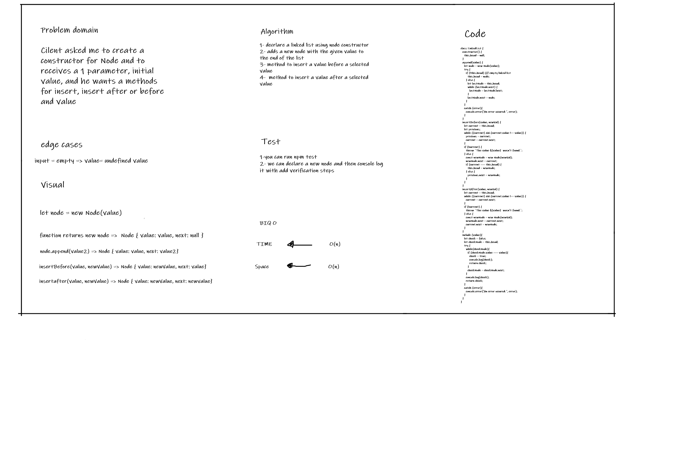

# Array Binary Search
The challenge about returning the index of the provided number if it exists in the provided array, in case it isn't exist we will retrun a value of -1 

## Whiteboard Process

## Approach & Efficiency
Time flexability and space flexibality 

## Solution

I have structured a way to check the before and after value to insert a new values