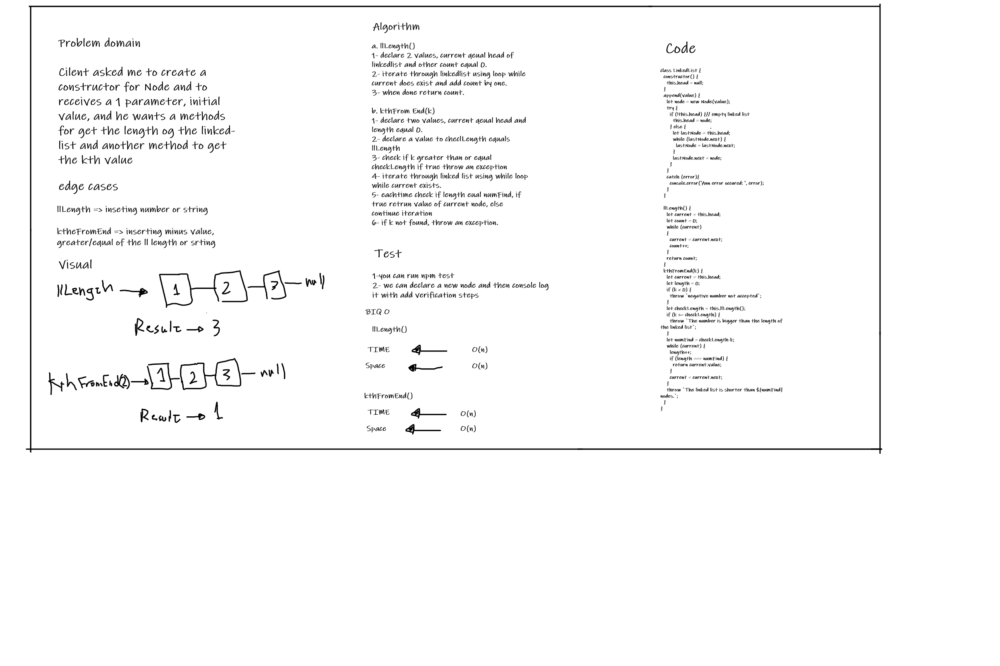

# ll-kth-from-end

Insert a number in the parameter and return the value of the node that it's location in the linkedlist equals the number, else throw an exception.

## Whiteboard Process

## Approach & Efficiency

BigO:

1. llLength ->  Time: O(n).
                  Space: O(n).
2. kthFromEnd ->  Time: O(n).
                  Space: O(n).

## Solution
I have provided a method to get the length of the linked-list and to get the kth value 

