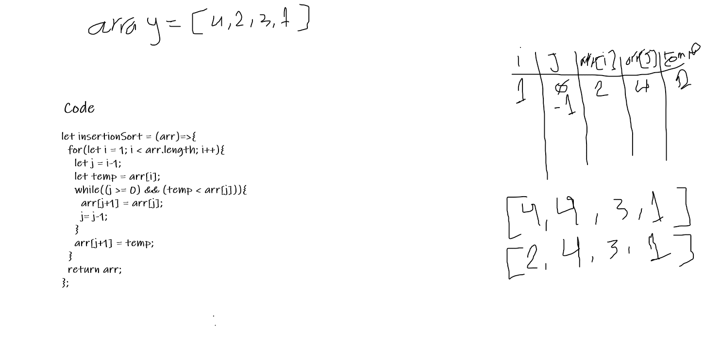
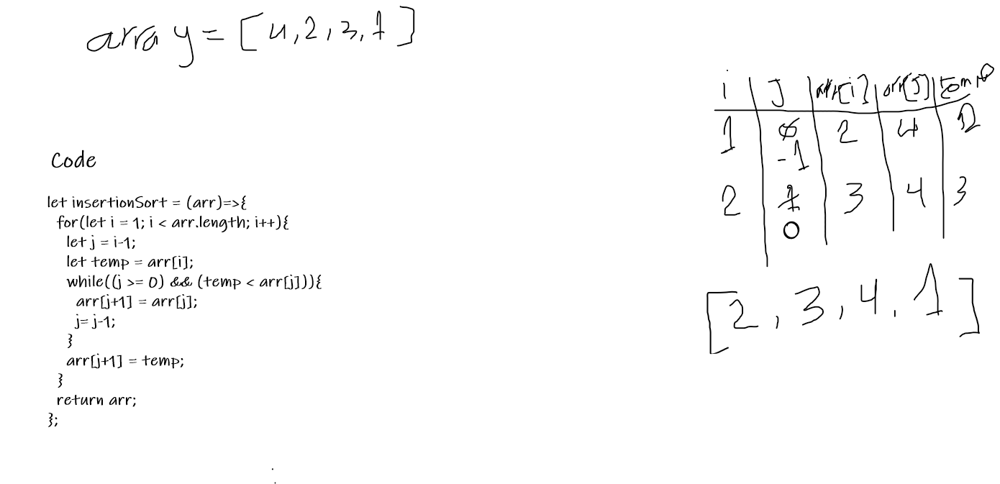
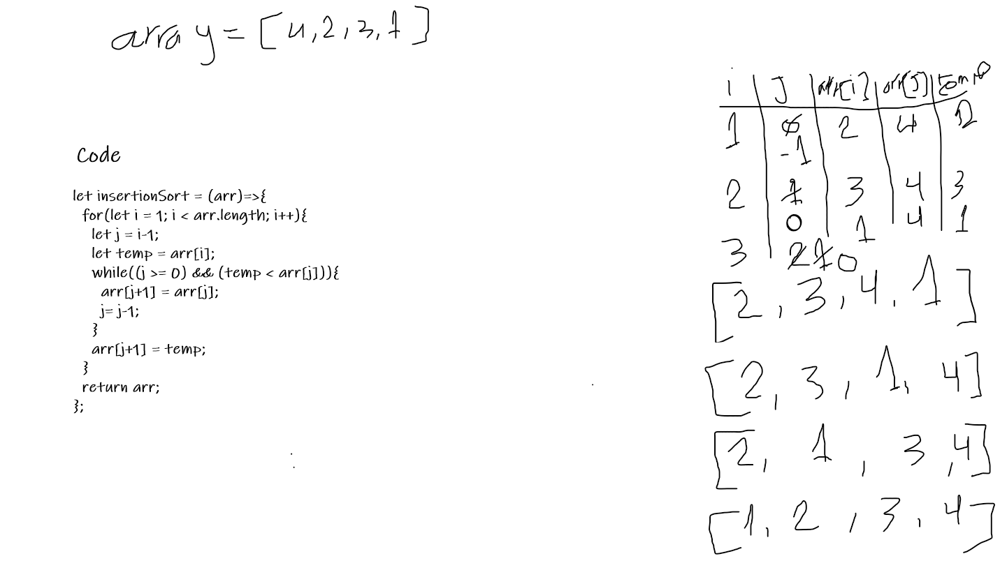
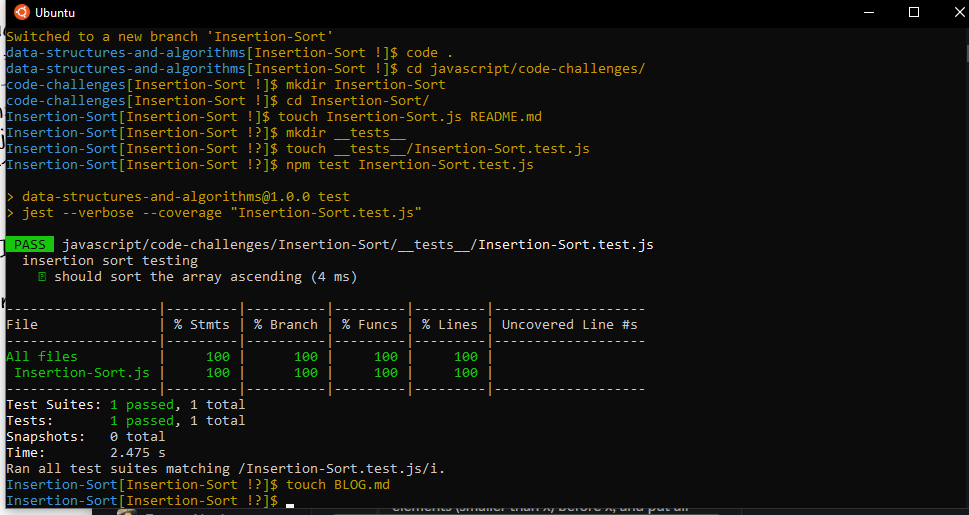

# Insertion Sort

insertion sort is an algorithm to sort an array ascending by iterate over the values of the array and set each index depend on its value.

## Pseudocode

     InsertionSort(int[] arr)
  
    FOR i = 1 to arr.length
    
      int j <-- i - 1
      int temp <-- arr[i]
      
      WHILE j >= 0 AND temp < arr[j]
        arr[j + 1] <-- arr[j]
        j <-- j - 1
        
      arr[j + 1] <-- temp

      
      
## Trace 

Sample Array: [4,2,3,1]

## Test

## Efficency

Time: O(n^2)

Space: O(1)
