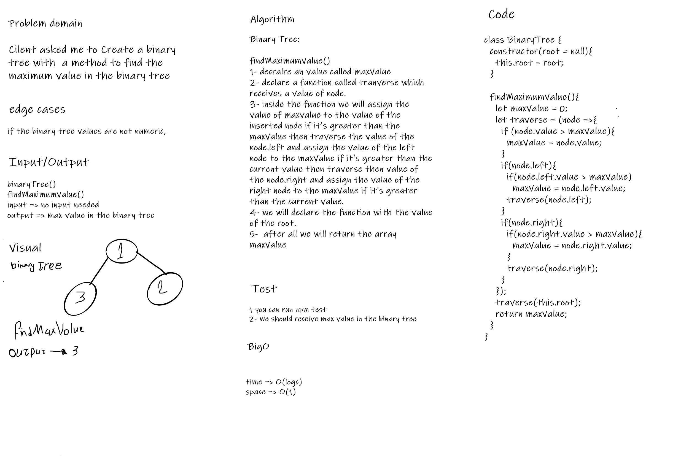

# Challenge Summary
Create a class of binary tree with a method to find the max value

## Whiteboard Process

## Approach & Efficiency
### findMaximumValue()
time => O(logc)
space => O(1)

## Solution
I have solved it like iterate over the tree nodes and assign the value of the max to a value whenever it exists