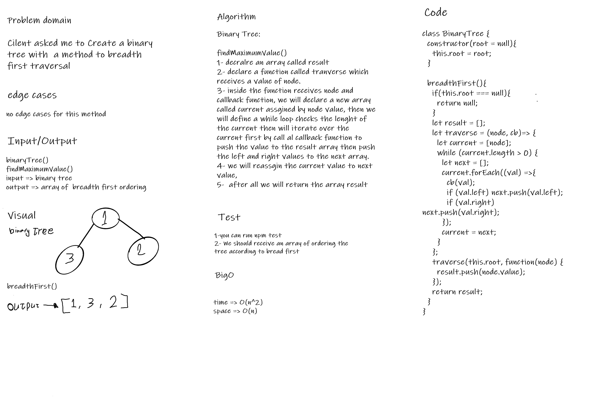

# Challenge Summary
The code code challenge about make a new method to the binary tree to order the tree by bread first 

## Whiteboard Process

## Approach & Efficiency
BigO
breadthFirst():
time => O(n^2)
space => O(n)

## Solution
you can just use breadthFirst() method with a tree and it will be ordered by bread first 