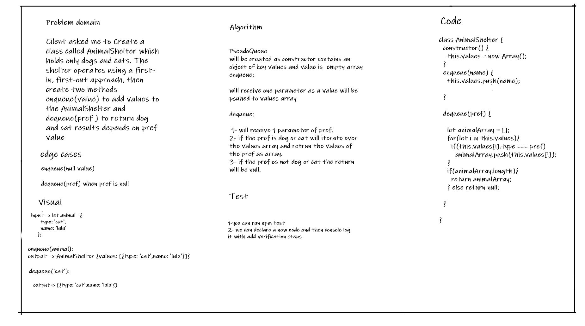

# Challenge Summary
The code challenge about creating a class of AnimalShelter for dog and cat, has a methods of enqueue to add to the shelter and dequeue to return a results depends on pref value.
## Whiteboard Process

## Approach & Efficiency

#### enqueue():
* time => O(1)
* space => O(1)

#### dequeue():
* time => O(n)
* space => O(n)

## Solution
I have figured out how to add values and return results according to the pref value using enqueue and desqueue methods
