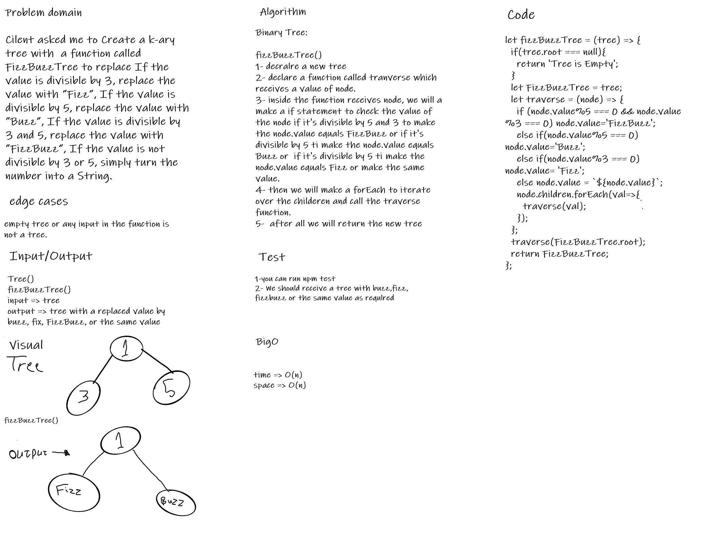

# Challenge Summary
 Create a k-ary tree with  a function called FizzBuzzTree to replace If the value is divisible by 3, replace the value with “Fizz”, If the value is divisible by 5, replace the value with “Buzz”, If the value is divisible by 3 and 5, replace the value with “FizzBuzz”, If the value is not divisible by 3 or 5, simply turn the number into a String.
## Whiteboard Process

## Approach & Efficiency
fizzBuzzTree()
time => O(n)
space => O(n)

## Solution
I have done the needful to return the required results depends on the instructions