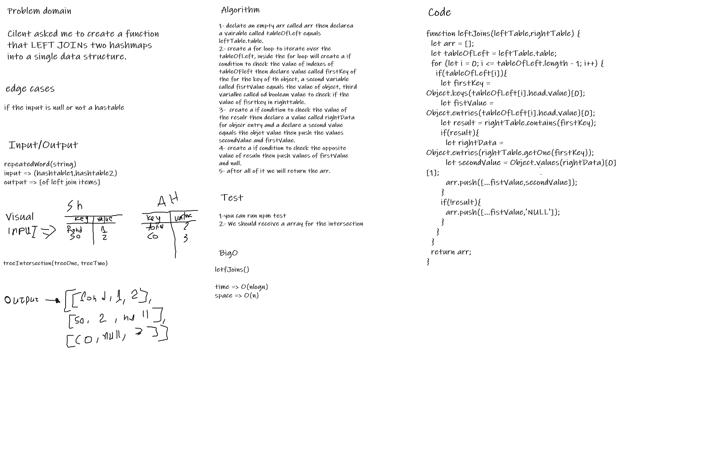

# LEFT JOINs
## Challenge Summary

Create a function that takes two Hash Tables and return an array of keys of left table and values of both tables if right table has the same key, else right table value will equal NULL.
## Whiteboard Process

## Approach & Efficiency

1. ***leftJoins(leftTable,rightTable)***:
 Time:  O(nlogn).
 Space: O(N).
 
## Solution

I have written a code to join left as required