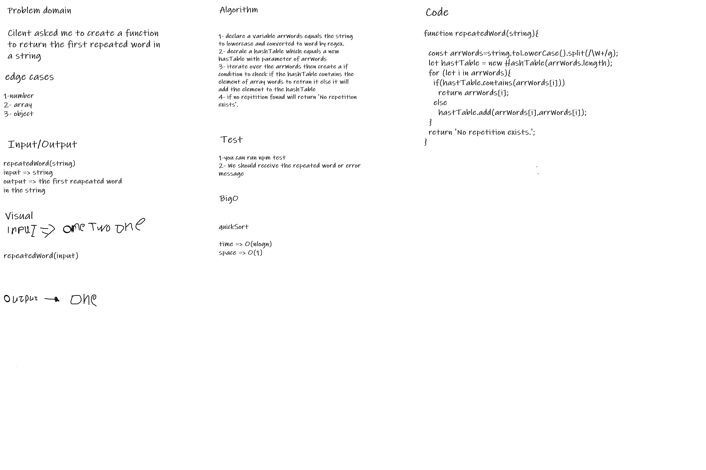

# Repeated word

## Challenge Summary
Create functions that take a strings and return the first repeated word using HashTable.

## Whiteboard Process

## Approach & Efficiency

1. ***repeatedWord(string)*** ->      Time:  O(nlogn).
                                      Space: O(1).
## Solution

I have written a code that return the first repetitive word in a hash table.