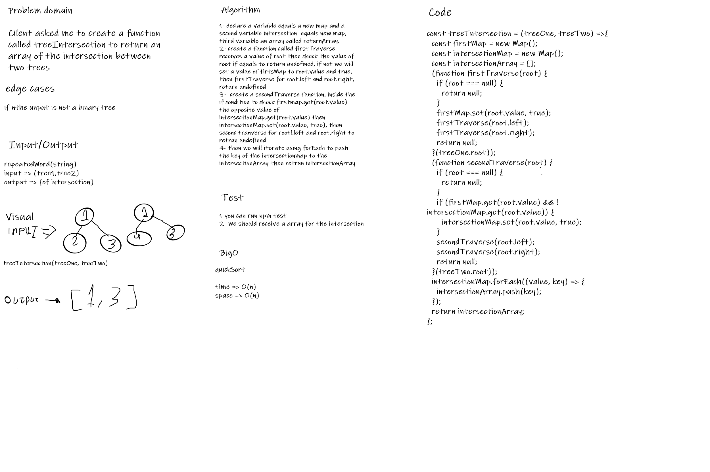

# Repeated word

## Challenge Summary
Create functions that take a a two binary  trees and return an array of intersection.

## Whiteboard Process

## Approach & Efficiency

1. ***treeIntersection(treeOne, treeTwo)***

* Time:  O(n).
* Space: O(n).

## Solution

I have written a code that return a array of intersection for two binary trees.