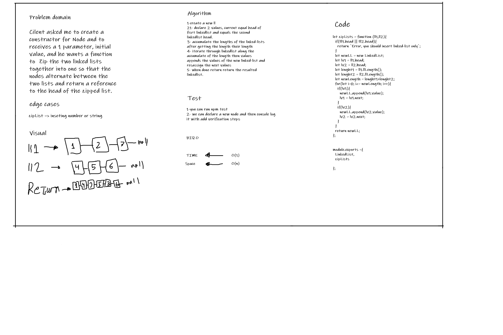

# Challenge Summary
create a function called zipLists to zip two linked-lists regardless their length

## Whiteboard Process

## Approach & Efficiency
time and space flexability 

## Solution
I have created a function can be used to zip two linked-lists after passing them as a parameters inside the function
