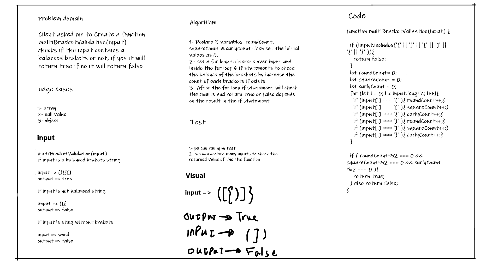

# Challenge Summary
Create a function multiBracketValidation(input) checks if the input contains a balanced brakets or not, if yes it will return true if no it will return false

## Whiteboard Process

## Approach & Efficiency
#### multiBracketValidation(input):
* time => O(n)
* space => O(n)

## Solution
I have created a conter for each bracket type then return the results accordingly 
