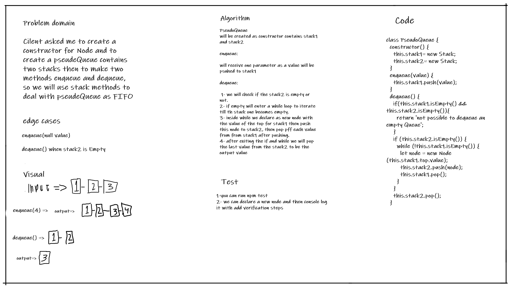

# Challenge Summary
PseudeQueue will be created using two stacks and then we will dea; with it using stack methods as FIFO.
## Whiteboard Process

## Approach & Efficiency
#### enqueue():
* time => O(1)
* space => O(1)

#### dequeue():
* time => O(n)
* space => O(n)

## Solution
I have done the needful to match the requirements especially for dequeue it took to much time to make it implemeted correctly 