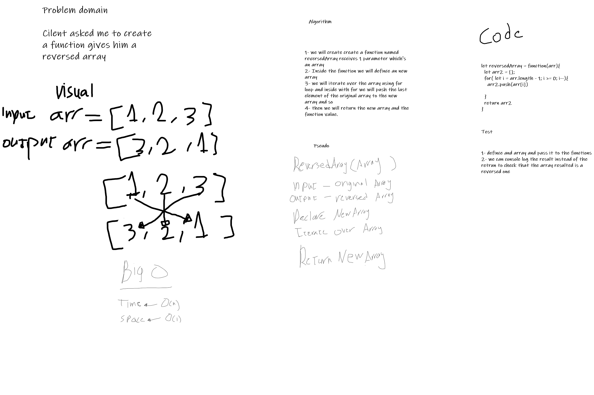

# Reverse an Array
The challenge about creating a function to reverse an array without using the bulit-in methods available to JavaScripts

## Whiteboard Process

## Approach & Efficiency
Time flexability and space flexibality 