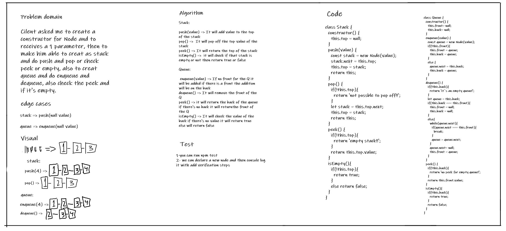

# Stacks and Queues
the challenge is about create as constructor for stack and queue.

## Challenge
the challenge is about create as constructor for stack and queue.then to make methods push,pop,peek and isEmpty for the stack, and enqueue,dequeue,peek and isEmpty for the queue

## Approach & Efficiency
BigO:
Stack | Queue
--------|---
push(value): time => O(1) space => O(1) | enqueue(value): time => O(1) space => O(1)
pop(): time => O(1) space => O(1) |   dequeue(): time => O(1) space => O(1)
peek():time => O(1) space => O(1) | peek():time => O(1) space => O(1)
isEmpty(): time => O(1) space => O(1) | isEmpty(): time => O(1) space => O(1)

## API
### Stack: 

* push(value) => It will add value to the top of the stack
* pop() =>  It will pop off the top value of the stack
* peek() => It will return the top of the stack
* isEmpty() =>  it will check if that stack is empty or not then return true or false
 
### Queue:

* enqueue(value) => If no front for the Q it will be added if there is a front the addition will be on the back
* dequeue() => It will remove the front of the Q 
* peek() => it will return the back of the queue if there's no back it will returnthe front of the Q
* isEmpty() => It will check the value of the back if there's no value it will return true else will return false

## Whiteboard 

