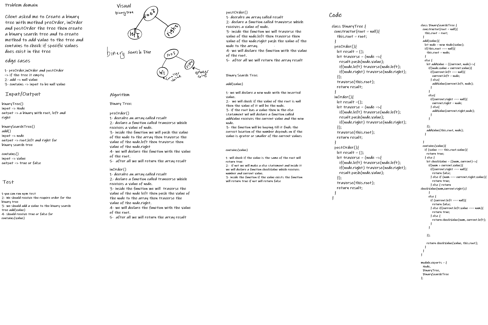

# Trees
In this challenge we will create a binary tree and binary search tree
## Challenge
In this challenge we will create a binary tree and binary search tree, for the binary tree we will make 3 methods for ordering, preOrder(), inOrder() and postOrder(), and for the binary search tree we will make two methods, add() and contains().

## Approach & Efficiency
### BigO:
PreOrder, inOrder and postOrder:
time => O(logc)
space => O(1)

add():

time => O(n)
space => O(n)

constains():

time => O(n)
space => O(n)

## Whiteboard 
