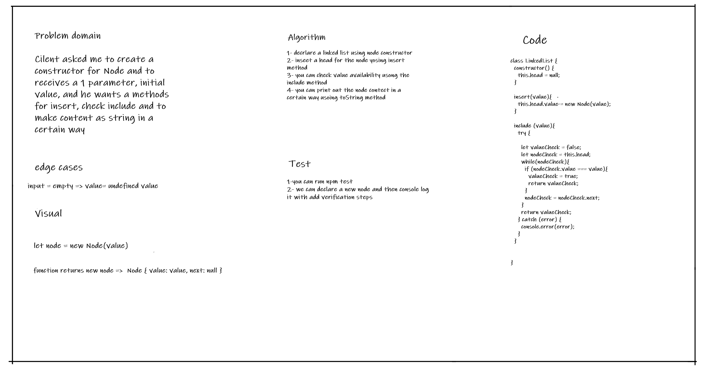

# Singly Linked List

## Challenge

The challenge about create a linked list using a node constructor and to insert a head value and search for value using include method, finlally you can print out linked list contet using toString method 

## Whiteboard Process

## Approach & Efficiency
Time flexability and space flexibality 

## API

* insert: insert a value into the linked list
* include: will search for value and return true or false depending on its existance 
* ToString: will return the contec of the linked list as a string in specific form 